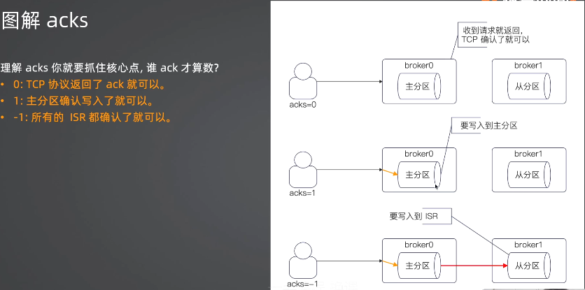

消息队列

基本形态是有N个生产者，N个消费者，还有一个消息队列服务。生产者向消息队列服务投递消息，而消费者从消息队列服务中取出这些消息进行消费。


### 基本概念

- producer

  生产者

- consumer

  消费者

- broker

  提供消息队列的服务。在实践中，一个broker就是一个消息队列进程，也可以认为一个broker就是一台机器。

topic

partition

消费者与消费组


### topic

topic用于表示消息队列上不同的业务。

简单来说一个topic就是一个业务，比如我有一个发送邮件的业务，它就可以是一个topic。个人理解topic就是用于区分消息的类型。

在kafka中，topic是由一个或多个partition（分区）组成的。一个分区可以理解成一个文件，存储着该分区所属的topic的消息。多个分区是为了提高消息的吞吐能力（即投递速率和消费速率）。

> topic的分区估算 = max((生产者投递速率 / 单个分区的消息接收速率), (生产者投递速率 / 单个消费者的消费速率)) + 预留值


**主分区和从分区**

一般的我们说topic有多少个分区说的是主分区，实际上一个分区除了主分区还有从分区。

当消息发送到kafka上时，消息会先写入主分区，再同步到从分区。主从分区的这种设计是为了保证高可用和数据不丢失，如果某个主分区挂了就可以从从分区中选举出新的主分区继续提供服务，这是高可用。

如何提现出数据不丢失呢？


**分区和broker的关系**

正常情况下一个topic的分区会尽量均匀分散到所有的broker上。这意味着俩件事情：

- 主分区之间（同个topic）不会在同一个broker上。
- 同一个分区的主从分区，不会再同一个broker上。

核心目标就是保证服务的高可用：如果某个broker奔溃，散落在其他broker的主分区仍然能够提供服务，不至于导致某个topic的服务完全不可用。

> 当满足上面的要求时，如果某个broker奔溃时，最多导致topic的某一个主分区不可用。


**分区与生产者的关系**

一个topic有多个分区，因此生产者发送消息时就需要选择一个分区，一般有三种策略：

- 轮询，比如对分区数量取模。
- 随机
- 哈希


**消息有效性**

kafka中消息的有序性是通过分区来保证的。

一个分区内的消息是有序的，也就是说生产者往同个分区发送消息的顺序，就是该分区消费者的处理消息顺序。

如果要做到业务有序，就要保证业务消息都丢到同一个分区中。


**分区与消费者、消费者组的关系**

在kafka中，消费者都是归属到某个消费者组的。比如新建用户时，搜索服务关心新用户、推荐服务也关系新用户，那么这俩个服务都可以是独立的消费者组。

同一个消费者组中：

- 一个分区在同一个时刻只可能被一个消费者消费。
- 一个消费者可以消费多个分区的数据。


一个分组最多一个消费者？这意味着什么？

- 如果一个topic有N个分区，那么同个消费者组最多有N个消费者。多出的消费者会被忽略。
- 如果消费者性能很差，你无法通过无限增加消费者来提高性能。

注：前期条件是这些消费者在同一个消费者组。


### Sarama

生产者发送数据的关键参数。

acks：有三个取值。

- 0

  客户端发一次，不需要服务端的确认。这里的意思是只要消息通过tcp连接发送成功就认为发送完成，但是broker是否写入成功是未知的。

- 1

  客户端发送，并且需要服务的写入主分区

- -1

  客户端发送，并且需要服务端同时同步到所有的ISR上。

从上到下性能主键变差，但是数据可靠性逐渐上升。需要性能选0，需要可靠性选-1。



ISR（In Sync Replicas），保持了同步的副本。通俗易懂的解释就是跟上节奏的从分区，就是说从分区跟主分区保持数据同步。所以当消息被同步到从分区之后，如果主分区奔溃了，依旧能保证在从分区上还有数据。


### 消息的偏移量

偏移量（offset）的作用？

消息的读取是一直向后读取的，不管消息有没有被标记。我认为标记一个消息就是通过offset标记当前已经消费到哪个消息了。这样在消费者程序下次启动时就会从该offset+1起读取消息。


从目前的测试中，使用sarama的默认配置，每次启动消费者时，总是从最后一次提交消息的offset为准去读取消息。就是说从最后一条提交的消息的offset再加1作为起始下标来读取消息。

测试代码：

```go
// 生产者的实现
func TestSyncProducer(t *testing.T) {
	config := sarama.NewConfig()
	config.Producer.RequiredAcks = sarama.WaitForAll
	config.Producer.Return.Successes = true
	config.Producer.Return.Errors = true

	producer, err := sarama.NewSyncProducer(addr, config)
	config.Producer.Partitioner = sarama.NewRoundRobinPartitioner
	require.NoError(t, err)

	defer func() {
		if err := producer.Close(); err != nil {
			t.Logf("producer close error, %v", err)
		}
	}()

	for i := 0; i < 3; i++ {
		partition, offset, err := producer.SendMessage(&sarama.ProducerMessage{
			Topic: "my_topic",
			Value: sarama.StringEncoder("hello."),
		})
		assert.NoError(t, err)
		t.Logf("partition = %d, offset = %d", partition, offset)
	}

}

// sarama消费消息的实现
func (c *ConsumerHandler) ConsumeClaim(session sarama.ConsumerGroupSession, claim sarama.ConsumerGroupClaim) error {
	c.t.Logf("topic: %s, partition: %d", claim.Topic(), claim.Partition())
	msgs := claim.Messages()
	for msg := range msgs {
		c.t.Logf("message: %s, topic: %s, partition: %d, offset: %d", string(msg.Value), msg.Topic, msg.Partition, msg.Offset)
		c.t.Log(msg.Offset % 2)
		if msg.Offset%2 == 0 {
			session.MarkMessage(msg, "")
		}
	}
	return nil
}

/*
生产者发送offset为1、2、3的3条消息。
多次启动消费者代码，可以发现总是会从offset=3读取消息。

生产者发送offset为4、5、6的3条消息。
多次启动消费者代码，可以发现总是会从offset=6+1读取消息，这是读取不到新的消息。

总结：
如果有一条消息消费了但是没有提交，你在每次启动消费者程序时总是会读取到这条消息，直到你提交该条消息或者是提交下一条消息。记住总是以最条一条提交消息的offset+1作为下标来读取消息的。

消费一批消息也是一样的，如果一批消息其中有些消息未提交标记，但是只要提交消息的offset大于这些未提交消息的offset，在下次重启消费者程序时是不会读取到这些未提交标记的消息的。
*/
```


shell

```
kafka-topics.sh --bootstrap-server=127.0.0.1:9092 --topic=my_topic --describe
kafka-console-consumer.sh --bootstrap-server=127.0.0.1:9092 --topic=my_topic
```


### 问题

- kafka如何设置数据保存的时间？

- 测试kafka分片消费消息的顺序

- sarama的偏移量设置，最新和最旧有什么区别?

  OffsetNewest、OffsetOldest

- 如果多个goroutine返回错误，那么errGroup.Wait()究竟返回的是哪个错误？


